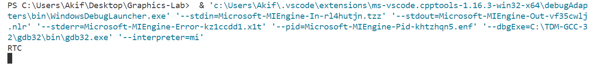

# Computer Graphics Lab

This repository contains my Computer Graphics Lab Finals experiments and code.
- **3rd Year 2nd Semester, Computer Science & Engineering, University of Rajshahi**
- **GitHub: [@akifislam](https://github.com/akifislam) | Gmail: iamakifislam@gmail.com**

# Lab Tasks
- **Draw the National Flag of Bangladesh ✓**
- **Simulate two dimensional geometric Translation, Rotation & Scaling ✓**
- **Draw a line with the Bresenham Line Drawing algorithm ✓**
- **Draw a circle with the Bresenham Circle Drawing algorithm ✓**
- **Simulate Hidden Surface Elimination or Visual Surface Detection ✓**
- **Implement the Cohen Sutherland Line Clipping algorithm ✓**
- **Implement the Sutherland Hodgman Polygon Clipping algorithm✓** 
- **Create the Bejier Curve ✓**
- **Draw the Snowflake Pattern with Fractal Geometry✓**

# CodeBlocks Setup Instructions
- Download **TDM GCC 32 Bit Compiler** from this link: https://jmeubank.github.io/tdm-gcc/
- Download Graphics Library: https://drive.google.com/file/d/1z19xxKm2YseQi7QGxqCCdJ-lLfiEGuCm/view
- Extract Graphics Library
- Copy **graphics.h & winbgim.h** and paste it in **"C:\\TDM-GCC-32\\include"**
- Copy **libbgi.a** and paste it in **"C:\\TDM-GCC-32\\lib"**
- Now go to **CodeBlocks -> Settings -> Compiler** 
- Go to "Toolchain executables" & change Compiler's installation directory to **"C:\\TDM-GCC-32"**
- Go to "Linker Settigns" -> Other linker options & add **"-lbgi -lgdi32 -lcomdlg32 -luuid -loleaut32 -lole32"**


# Experiment 01 - Draw the National Flag of Bangladesh

```c++
#include<bits/stdc++.h>
#include<graphics.h>

using namespace std;

int main(){
    int gd = DETECT;
    int gm = DETECT;

    initgraph(&gd,&gm,"");

    // Setting Rectangle Parameter by maintaining width:height = 10:6 ratio
    int scale_factor = 30;

    int x1;
    int y1;
    cout<<"Enter the start point of the flag (x1,y1):";
    cin>>x1;
    cin>>y1;

    int x2 = x1+10*scale_factor;
    int y2 = y1+6*scale_factor;

    // Drawing Rectangle
    setcolor(GREEN);
    setfillstyle(SOLID_FILL,GREEN);
    rectangle(x1,y1,x2,y2);
    floodfill(x1+1,y1+1,GREEN);

    //Drawing Circle
    setcolor(RED);
    setfillstyle(SOLID_FILL,RED);
    circle(x1+(x2-x1)*0.45,y1+(y2-y1)*0.5, 2*scale_factor);
    floodfill(x1+(x2-x1)*0.45+1,y1+(y2-y1)*0.5+1,RED);

    //Drawing a Handle
    setcolor(WHITE);
    setfillstyle(SOLID_FILL,WHITE);
    rectangle(x1-max(scale_factor/3,10),y1,x1,y2*2);

    getch();

}
/*
    AKIF ISLAM
    1910776135
*/
```
### Input 


### Output


# Experiment 02 - Simulate Two Dimensional Geometric Translation, Rotation & Scaling

## Translation
```c++
#include<bits/stdc++.h>
#include<graphics.h>

using namespace std;

void draw_polygon(vector<pair<int,int>> poly,int color){
    
    setcolor(color);    

    for (int i = 0; i < poly.size(); i++)
        line(poly[i].first,poly[i].second,poly[(i+1)%poly.size()].first,poly[(i+1)%poly.size()].second);

}

int main(){

    int gd = DETECT;
    int gm = DETECT;

    initgraph(&gd,&gm,"");

    // Taking No of Sides of a Polygon
    cout<<"Enter No of  Side : ";
    int no_of_side;
    cin>>no_of_side;

    // Taking co-ordinates of the sides
    vector<pair<int,int>> coordinates;
    
    for (int i = 0; i < no_of_side; i++)
    {   
        int x,y;
        cout<<"Enter (X"<<i+1<<",Y"<<i+1<<"):";
        cin>>x>>y;
        coordinates.push_back({x,y});

    }

    //Taking Translation Factor
    cout<<"Enter Translation Factor (Tx,Ty) :";
    int tx,ty;
    cin>>tx>>ty;
    
    draw_polygon(coordinates,7);
    
    //Translate all points
    for (int i = 0; i < coordinates.size(); i++)
    {
        coordinates[i].first+=tx;
        coordinates[i].second+=ty;
    }

    draw_polygon(coordinates,2);
    getch();

}
```
### Input 


### Output


## Rotation
```c++
#include<bits/stdc++.h>
#include<graphics.h>

using namespace std;

double to_radian(int degree){
    return (degree*3.1416)/180;
}

void draw_polygon(vector<pair<int,int>> poly,int color){
    
    setcolor(color);    

    for (int i = 0; i < poly.size(); i++)
        line(poly[i].first,poly[i].second,poly[(i+1)%poly.size()].first,poly[(i+1)%poly.size()].second);

}

int main(){
    
    int gd = DETECT;
    int gm = DETECT;

    initgraph(&gd,&gm,"C:\\Users");

    // Taking No of Sides of a Polygon
    cout<<"Enter No of  Side : ";
    int no_of_side;
    cin>>no_of_side;

    // Taking co-ordinates of the sides
    vector<pair<int,int>> coordinates;
    
    for (int i = 0; i < no_of_side; i++)
    {   
        int x,y;
        cout<<"Enter (X"<<i+1<<",Y"<<i+1<<"):";
        cin>>x>>y;
        coordinates.push_back({x,y});

    }

        
    cout<<"Rotation Angle in Degree : ";
    int angle;
    cin>>angle;
    
    //Taking Scaling Factor
    cout<<"Enter Pivot Point for Rotation (rx,ry) :";
    int rx,ry;
    cin>>rx>>ry;


    draw_polygon(coordinates,14);
 
    //Translate to Origin, Then Rotate, Then Back to Pivot Point
    for (int i = 0; i < coordinates.size(); i++)
    {
        double x = coordinates[i].first;
        double y = coordinates[i].second;
        
        //Move to Origin
        int x_shift=x-rx;
        int y_shift=y-ry;
    
        //Rotate
        x = x_shift*cos(to_radian(angle))-y_shift*sin(to_radian(angle));
        y = x_shift*sin(to_radian(angle))+y_shift*cos(to_radian(angle));

        //Back to Pivot Point
        x+=rx;
        y+=ry;

        coordinates[i].first = x;
        coordinates[i].second = y;   
    }

    draw_polygon(coordinates,2);
    getch();

}
```
### Input 


### Output


## Scaling
```c++
#include<bits/stdc++.h>
#include<graphics.h>

using namespace std;

void draw_polygon(vector<pair<int,int>> poly,int color){
    
    setcolor(color);    

    for (int i = 0; i < poly.size(); i++)
        line(poly[i].first,poly[i].second,poly[(i+1)%poly.size()].first,poly[(i+1)%poly.size()].second);

}

int main(){

    int gd = DETECT;
    int gm = DETECT;

    initgraph(&gd,&gm,"");

    // Taking No of Sides of a Polygon
    cout<<"Enter No of  Side : ";
    int no_of_side;
    cin>>no_of_side;

    // Taking co-ordinates of the sides
    vector<pair<int,int>> coordinates;
    
    for (int i = 0; i < no_of_side; i++)
    {   
        int x,y;
        cout<<"Enter (X"<<i+1<<",Y"<<i+1<<"):";
        cin>>x>>y;
        coordinates.push_back({x,y});

    }

    //Taking Scaling Factor
    cout<<"Enter Scaling Factor (Sx,Sy) :";
    int sx,sy;
    cin>>sx>>sy;
    
    draw_polygon(coordinates,7);
    //Translate all points
    for (int i = 0; i < coordinates.size(); i++)
    {
        coordinates[i].first*=sx;
        coordinates[i].second*=sy;
    }

    draw_polygon(coordinates,14);
    getch();

}
```
### Input 


### Output


# Experiment 03 - Hidden Surface Elimination
```c++
#include<bits/stdc++.h>
#include<graphics.h>

using namespace std;

void Triangle()
{
    int x[] = {10, 50, 100};
    int y[] = {100, 20, 100};
    
    setcolor(YELLOW);

    for (int i = 0; i < 3; i++)
    {
        line(x[i], y[i], x[(i + 1) % 3], y[(i + 1) % 3]);
    }
    setfillstyle(SOLID_FILL, YELLOW);
    floodfill(50, 25, YELLOW);
}

void Circle()
{
    setcolor(RED);
    circle(100, 100, 45);
    setfillstyle(SOLID_FILL, RED);
    floodfill(101, 101, RED);
}

void Rectangle()
{
    setcolor(GREEN);
    rectangle(100-20, 100-20, 180, 180);
    setfillstyle(SOLID_FILL, GREEN);
    floodfill(101, 101, GREEN);
}

int main()
{
    string sequence;
    cin >> sequence;
	int gd = DETECT;
	int gm = DETECT;
	initgraph(&gd, &gm, "");
    
    for (int i = 0; i < sequence.size(); i++)
    {
        if(sequence[i]=='C')
            Circle();
        else if(sequence[i]=='R')
            Rectangle();
        else
            Triangle();
    }
    

    getch();
    return 0;
}
```
### Input 


### Output


# Experiment 04 - Bresenham Line Drawing
```c++
#include<bits/stdc++.h>
#include<graphics.h>

using namespace std;

int main(){
    int gd = DETECT;
    int gm = DETECT;
    initgraph(&gd,&gm," ");

    cout<<"Enter (x1,y1):";
    int x1,y1;
    cin>>x1>>y1;

    cout<<"Enter (x2,y2):";
    int x2,y2;
    cin>>x2>>y2;

    int dx = x2-x1;
    int dy = y2-y1;

    int cur_x = x1;
    int cur_y = y1;
    outtextxy(cur_x,cur_y,"X1,Y1");
    putpixel(cur_x,cur_y,14);
    int P = 2*dy-dx;
    
    while(cur_x<x2 || cur_y<y2){    
        if(P<0){
            cur_x++;
            putpixel(cur_x,cur_y,14);
            P+=2*dy;
        }
        else{
            cur_x++;
            cur_y++;
            putpixel(cur_x,cur_y,14);
            P+=2*dy-2*dx;
        }


    }
    outtextxy(cur_x,cur_y,"X2,Y2");
    getch();
    
}
```

### Output


# Experiment 05 - Midpoint Circle Drawing Algorithm
```c++
#include <bits/stdc++.h>
#include <graphics.h>

using namespace std;

int main()
{

    int gd, gm;
    gd = DETECT, gm = DETECT;
    initgraph(&gd, &gm, "");

    // Input Parameter
    int r = 150;
    int x = 200;
    int y = 200;

    cin>>x>>y>>r;

    // Process
    int P = 1 - r;

    int cur_x = 0, cur_y = r;

    vector<pair<int, int>> points;

    while (cur_x < cur_y)
    {
        points.push_back({cur_x, cur_y});
        points.push_back({cur_y, cur_x});

        cur_x++;

        if (P < 0)
        {
            P += 2 * cur_x + 1;
        }
        else
        {
            cur_y--;
            P += 2 * (cur_x - cur_y) + 1;
        }
    }

    for (int i = 0; i < points.size(); i++)
    {  
        putpixel(x + points[i].first, y + points[i].second, WHITE);
        putpixel(x - points[i].first, y + points[i].second, WHITE);
        putpixel(x - points[i].first, y - points[i].second, WHITE);
        putpixel(x + points[i].first, y - points[i].second, WHITE);

    
    }

    getch();
}
```
### Output


# Experiment 06 - Bezier Curve
```c++
#include <bits/stdc++.h>
#include <graphics.h>

using namespace std;

int factorial(int n)
{
    if(n<2)
        return 1;
    return n*factorial(n-1);
}

double nCr(int n, int r)
{
    return (double)(factorial(n)/(factorial(r)*factorial(n-r)));
}

double bezierFunction(int k, int n, double u)
{
    return nCr(n, k) * pow(u, k) * pow((1 - u), (n - k));
}

void bezierCurve(vector<pair<int, int>> points)
{
    setcolor(YELLOW);
    int n = points.size() - 1;
    double eps = 0.0001;

    for (double u = 0; u <= 1; u += eps)
    {
        double x = 0, y = 0;
        
        for (int k = 0; k <= n; k++)
        {
            double bez = bezierFunction(k, n, u);
            x += points[k].first * bez;
            y += points[k].second * bez;
        }
        
        putpixel(x, y, WHITE);
    }
    for (auto x: points)
    {
        putpixel(x.first, x.second, WHITE);
        circle(x.first, x.second, 5);
    }
}

int main()
{
    int gd = DETECT, gm = DETECT;
    initgraph(&gd, &gm, "");

    vector<pair<int, int>> points = {{27, 243}, {101, 22}, {350, 90}, {437, 43}};
    bezierCurve(points);

    getch();
    closegraph();
    return 0;
}
```


### Output


# Experiment 07 - Cohen Sutherland Line Clipping
```c++
#include <graphics.h>
#include <bits/stdc++.h>

using namespace std;

double x_left = 120, x_right = 500, y_bottom = 100, y_top = 350; //... Clipping window
int Left = 1, Right = 2, Bottom = 4, Top = 8; //... Region code

int regionCode(int x, int y)
{
    int code = 0;
    if (x > x_right) code |= Right;
    else if (x < x_left) code |= Left;
    if (y > y_top) code |= Top;
    else if (y < y_bottom) code |= Bottom;
    return code;
}

void cohenSutherland(double x1, double y1, double x2, double y2)
{
    int code1 = regionCode(x1, y1);
    int code2 = regionCode(x2, y2);
    while (true)
    {
        double x, y;
        if (!(code1 | code2)) //... Line is completely inside
        {
            line(x1, y1, x2, y2);
            return;
        }
        else if (code1 & code2) break; //... Line is completely outside
        else //... Line is partially inside
        {
            int code = code1 ? code1 : code2;
            if (code & Top)
            {
                y = y_top;
                x = x1 + (x2 - x1) / (y2 - y1) * (y - y1);
            }
            else if (code & Bottom)
            {
                y = y_bottom;
                x = x1 + (x2 - x1) / (y2 - y1) * (y - y1);
            }
            else if (code & Left)
            {
                x = x_left;
                y = y1 + (y2 - y1) / (x2 - x1) * (x - x1);
            }
            else if (code & Right)
            {
                x = x_right;
                y = y1 + (y2 - y1) / (x2 - x1) * (x - x1);
            }
            if (code == code1)
            {
                x1 = x;
                y1 = y;
                code1 = regionCode(x1, y1);
            }
            else
            {
                x2 = x;
                y2 = y;
                code2 = regionCode(x2, y2);
            }
        }
    }
}

int main()
{
    int gd = DETECT, gm = DETECT;
    initgraph(&gd, &gm, "");

    setcolor(WHITE);
    rectangle(x_left, y_bottom, x_right, y_top);
    line(50, 200, 500, 400);
    setcolor(GREEN);
    cohenSutherland(50, 200, 500, 400);

    getch();
    closegraph();
    return 0;
}
```

### Output


# Experiment 08 - Sutherland Hodgeman Polygon Clipping

```c++
#include<iostream>
#include<graphics.h>
#include<fstream>
#include<vector>

using namespace std;

class Point{
    public:
        int x, y;

        Point(int x, int y)
        {
            this->x = x;
            this->y = y;
        }
};

Point intersect_point(Point p1, Point p2, 
                Point p3, Point p4)
{
    int xnum = (p1.x*p2.y - p1.y*p2.x) * (p3.x-p4.x) -
              (p1.x-p2.x) * (p3.x*p4.y - p3.y*p4.x);
    int xden = (p1.x-p2.x) * (p3.y-p4.y) - (p1.y-p2.y) * (p3.x-p4.x);

    int ynum = (p1.x*p2.y - p1.y*p2.x) * (p3.y-p4.y) -
              (p1.y-p2.y) * (p3.x*p4.y - p3.y*p4.x);
    int yden = (p1.x-p2.x) * (p3.y-p4.y) - (p1.y-p2.y) * (p3.x-p4.x);

    return Point(xnum/xden, ynum/yden);
}

vector<Point> clip(vector<Point> points, Point p1, Point p2)
{
    vector<Point> new_points;

    for(int i = 0; i < points.size(); i++)
    {
        int k = (i+1) % points.size();
        int ix = points[i].x;
        int iy = points[i].y;
        int kx = points[k].x;
        int ky = points[k].y;

        int i_pos = (p2.x - p1.x) * (iy - p1.y) - (p2.y - p1.y) * (ix - p1.x);

        int k_pos = (p2.x - p1.x) * (ky - p1.y) - (p2.y - p1.y) * (kx - p1.x);

        // Case 1 : When both points are inside
        if(i_pos < 0 && k_pos < 0)
        {
            new_points.push_back(Point(kx, ky));
        }

        // Case 2: When only first point is outside
        else if(i_pos >= 0 && k_pos < 0)
        {
            new_points.push_back(intersect_point(p1, p2, Point(ix, iy), Point(kx, ky)));

            new_points.push_back(Point(kx, ky));
        }
        
        // Case 3: When only second point is outside
        else if(i_pos < 0 && k_pos >= 0)
        {
            new_points.push_back(intersect_point(p1, p2, Point(ix, iy), Point(kx, ky)));
        }

        else 
        {
            // No points are added.
        }
    }


    return new_points;


}

vector<Point> southHodgeClip(vector<Point> points, vector<Point> clipper)
{
    for(int i = 0; i < clipper.size(); i++)
    {
        int k = (i+1) % clipper.size();

        points = clip(points, clipper[i], clipper[k]);

    }
    for(int i = 0; i < points.size(); i++)
    {
        cout<<points[i].x<<" "<<points[i].y<<endl;
    }
    return points;
}


void draw(vector<Point> points)
{
    points.push_back(points[0]);
    int n = points.size();
    int arr[ 2*n ];
    int j = 0;
    for(int i = 0; i < n; i++)
    {
        arr[j] = points[i].x;
        arr[j+1] = points[i].y;
        j += 2;
    }
    drawpoly(n, arr);
}

int main(int argc, char const *argv[])
{
    int gd = DETECT;
    int gm;
    
    vector<Point> clipper;
    clipper.push_back(Point(150, 150));
    clipper.push_back(Point(150, 200));
    clipper.push_back(Point(200, 200));
    clipper.push_back(Point(200, 150));

    initgraph(&gd, &gm, NULL);
    
    draw(clipper);
    
    int n;
    
    {
        ifstream cin("input.txt");
        cin>>n;
    }
    vector<Point> points;
    {
        ifstream cin("input.txt");
        cin>>n;
        int x, y;
        for(int i = 0; i < n; i++)
        {
            cin>>x>>y;
            points.push_back(Point(x, y));
        }
    }

    draw(points);
    getch();
    cleardevice();
    draw(clipper);
    points = southHodgeClip(points, clipper);

    setcolor(GREEN);
    draw(points);

    getch();
    closegraph();
    
    return 0;
}

```
# Experiment 09 - Snowflake Pattern with Fractal Geometry

```c++
#include <graphics.h>
#include <bits/stdc++.h>

using namespace std;

void snowfalke(int x1, int y1, int x5, int y5, int it)
{
    if (it)
    {
        vector<pair<int, int>> x(5);
        int dx = (x5 - x1) / 3, dy = (y5 - y1) / 3;
        x[0] = {x1, y1};
        x[1] = {x1 + dx, y1 + dy};
        x[2] = {(x1 + x5) / 2 + sqrt(3) * (y1 - y5) / 6, (y1 + y5) / 2 + sqrt(3) * (x5 - x1) / 6};
        x[3] = {x1 + 2 * dx, y1 + 2 * dy};
        x[4] = {x5, y5};
        for (int i = 0; i < 4; i++)
        {
            snowfalke(x[i].first, x[i].second, x[i + 1].first, x[i + 1].second, it - 1);
        }
    }
    else line (x1, y1, x5, y5);
    delay(5);
}

int main()
{
    int gd = DETECT, gm = DETECT;
    initgraph(&gd, &gm, "");

    int iteration = 4;
    vector<pair<int, int>> x = {{250, 15}, {50, 350}, {450, 350}};
    for (int i = 0; i < 3; i++)
    {
        snowfalke(x[i].first, x[i].second, x[(i + 1) % 3].first, x[(i + 1) % 3].second, iteration);
    }

    getch();
    closegraph();
    return 0;
}
```
(I implemented an easier version with a triangle shape)


### Output


# Thank you
